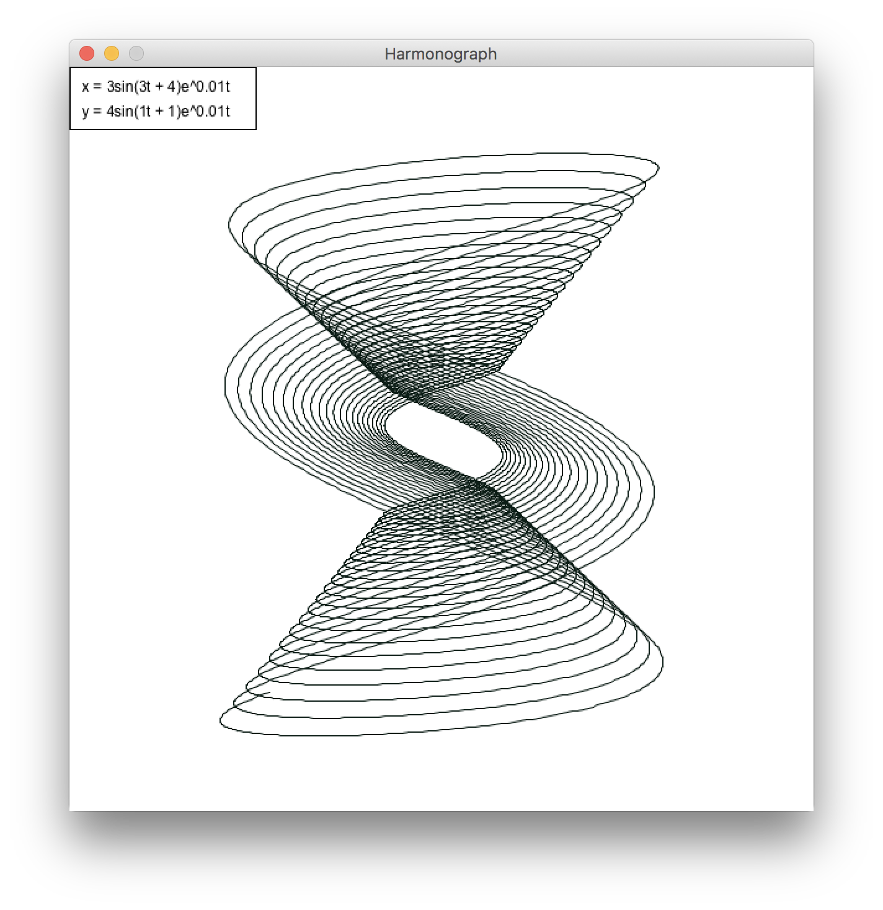
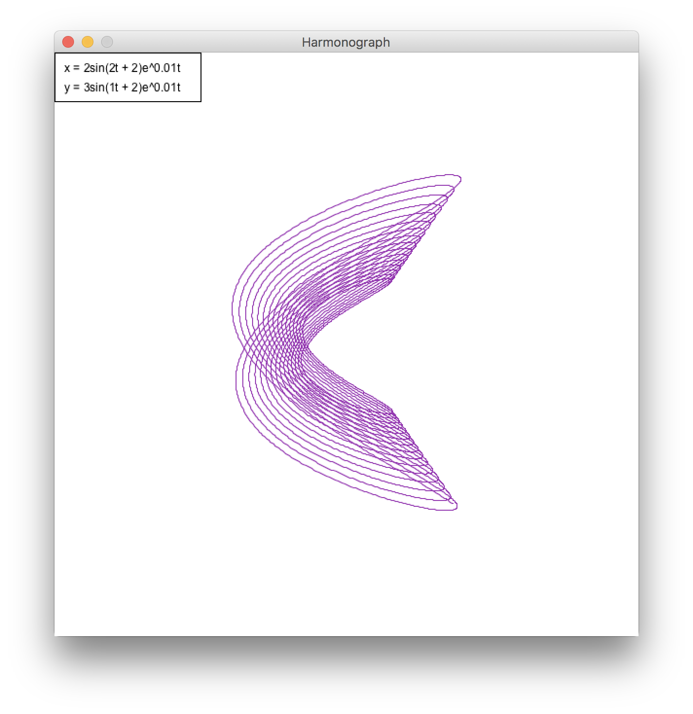
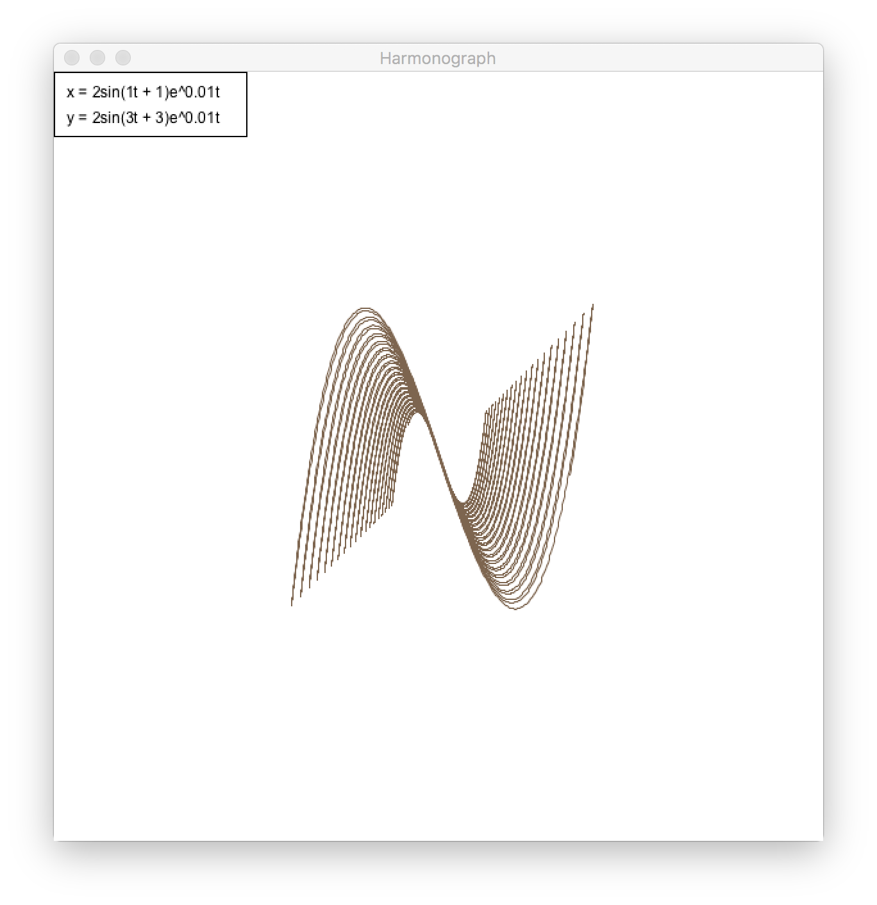

# Harmonograph Simulation

## Background
A harmonograph is a mechanical apparatus that employs pendulums to create a geometric image. The drawings created typically are Lissajous curves, or related drawings of greater complexity. Hugh Blackburn, a professor of mathematics at the University of Glasgow, is commonly believed to be the official inventor.1

1 [Wikipedia](https://en.wikipedia.org/wiki/Harmonograph)

## Simulation in Action

## Images Produced

## How Does it Work?

As seen in the top-left corner of each produced image, these figures can be represented by parametric equations where both x and y terms are functions of time in the form of decaying sine waves.   
With each frame of the simulation, an internal timer increments up, allowing the next point in the graph to be calculated. 

### The Decay

Since the harmonograph is a device comprised of two pendulums, each axis of motion can be descirbed by the equation  `axis(t) = Asin(ft + p) * e^(-dt)`